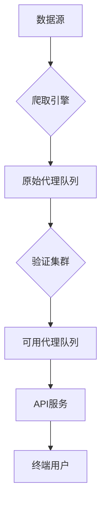
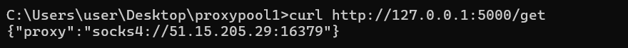
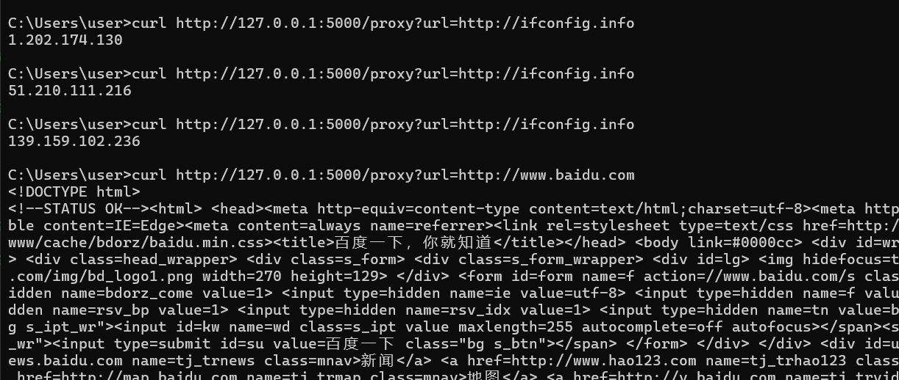
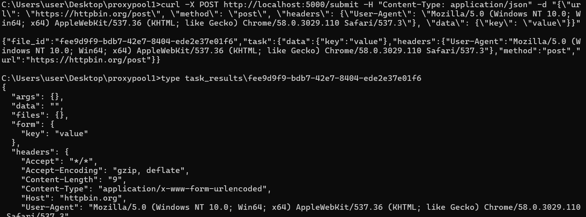

# ProxyHive 🐝


开箱即用的代理池系统，Like hive，集成13+公开代理源，提供高效稳定的代理服务与任务调度能力

## 核心功能

### 🛡️ 代理验证引擎
- 实时验证代理可用性（HTTP/HTTPS/SOCKS）
- 智能去重机制（基于BloomFilter）
- 动态速率控制（FlowRateLimiter）

### 🌐 服务接口
```http
GET /get          # 获取已验证代理
POST /submit      # 提交爬取任务
GET|POST /proxy   # 代理转发服务
```

### ⚙️ 管理系统
- 自动代理源维护（13+数据源）

- 弹性线程池管理（ThreadPoolExecutor）

  

## 快速开始

### 环境准备
```bash
# 克隆项目
git clone https://github.com/Zephyr236/ProxyHive.git

# 安装依赖
pip install -r requirements.txt
```

### 服务启动
```bash
# 生产模式（INFO日志）
python main.py

# 调试模式（DEBUG日志）
python main.py debug
```

## API文档

### 获取代理
```bash
curl -X GET "http://localhost:5000/get"
```
**响应示例**:
```json
{
  "proxy": "socks4://185.139.155.155:39123"
}
```

### 代理转发
```bash
curl -X GET "http://localhost:5000/proxy?url=http://ifconfig.info"

curl -X POST "http://localhost:5000/proxy?url=https://httpbin.org/post" -d "data=1"
```
**参数说明**:
- `url`：需要代理的目标URL（URL编码）

### 任务提交
```bash
curl -X POST http://localhost:5000/submit -H "Content-Type: application/json" -d "{\"url\": \"https://httpbin.org/post\", \"method\": \"post\", \"headers\": {\"User-Agent\": \"Mozilla/5.0 (Windows NT 10.0; Win64; x64) AppleWebKit/537.36 (KHTML; like Gecko) Chrome/58.0.3029.110 Safari/537.3\"}, \"data\": {\"key\": \"value\"}}"
```
**任务状态**:
```bash
dir task_results
# 查看生成的任务结果文件
```

## 代理源列表

| 源名称              |
| ------------------- |
| Geonode Proxy List  |
| Proxyscrape         |
| SSL Proxies         |
| Zdaye               |
| ...（共13个数据源） |

## 架构设计



## 扩展开发

### 添加新代理源
1. 在 `src/sources/` 目录创建新模块
2. 实现 Spider 类：
```python
class Spider:
    def __init__(self, raw_queue, usable_queue=None):
        self.raw_proxy_queue = weakref.proxy(raw_queue)
        
    def fetch(self, page):
        """数据抓取逻辑"""
        
    def parse(self, data):
        """数据解析逻辑"""
        """raw_proxy_queue.put(item)"""	#加入生产者队列
        
    def run(self):
        """任务执行入口"""
```

3. 在 `src/sources/__init__.py` 注册模块：
```python
modules = [..., new_module]
```


## 效果演示










## 反馈

很期待获取大家的创意和idea
